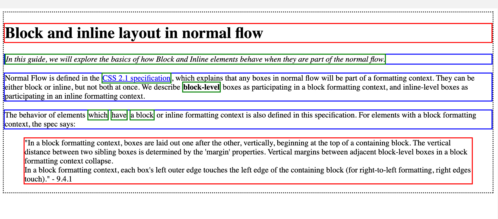

# The Client - Website

## Layout in CSS

Normal flow of _Flow Layout_ is de manier waarop _block_- en _inline_-elementen op een pagina worden weergegeven voordat er wijzigingen met CSS worden aangebracht. 

*Dat is wat je ziet als je “kale” HTML in de browser bekijkt, en als je gekleurde randen om verschillende elementen zou zetten. Elk element is een rechthoekige “box”. In _Flow Layout_ staan _block level_ boxen onder elkaar, en _inline level_ boxen naast elkaar.*

### Layout Modes

Met CSS kun je met verschillende *modes* een layout kan maken. We onderscheiden 7 layout modes. Onderzoek met je tafel de verschillende Layout Modes in CSS, en schets op het whiteboard van elke mode een voorbeeld:

- Flow Layout (Normal Flow)
- Grid Layout
- Flexible Box Layout (Flexbox)
- Positioned Layout (Relative, Absolute, Sticky, Fixed, Anchor)
- Float Layout
- Multi-column Layout
- Table Layout

### Layout in CSS oefenen

Om te oefenen met verschillende Layout Modes, hebben we de deeltaak “Layout in CSS” voor je klaargemaakt. Alles wat je hierin leert, kun je daarna toepassen in deze leertaak, voor je opdrachtgever.

Voer de [Layout in CSS deeltaak](https://github.com/fdnd-task/layout-in-css) uit, en ga door met de leertaak.

### Bronnen

- [Layout mode - MDN](https://developer.mozilla.org/en-US/docs/Web/CSS/Layout_mode)
- [Understandig Layout Algorithms - Josh Comeau](https://www.joshwcomeau.com/css/understanding-layout-algorithms/)