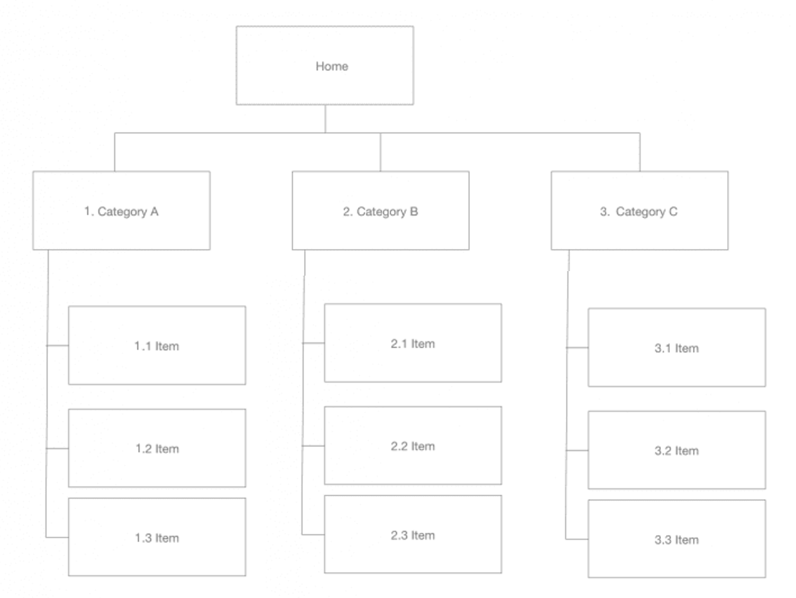
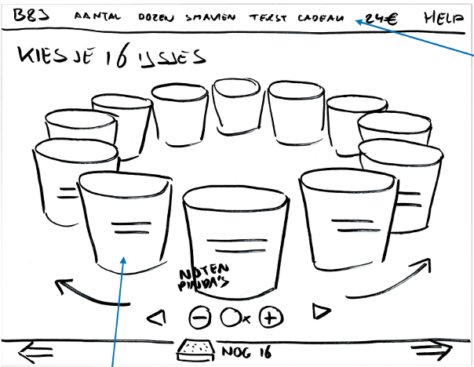
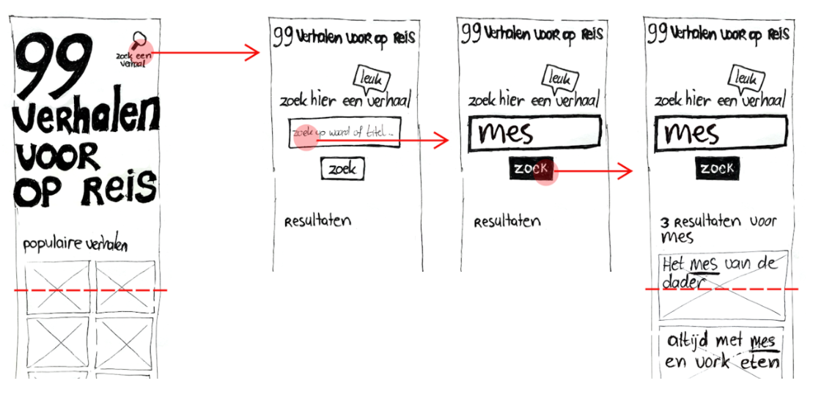
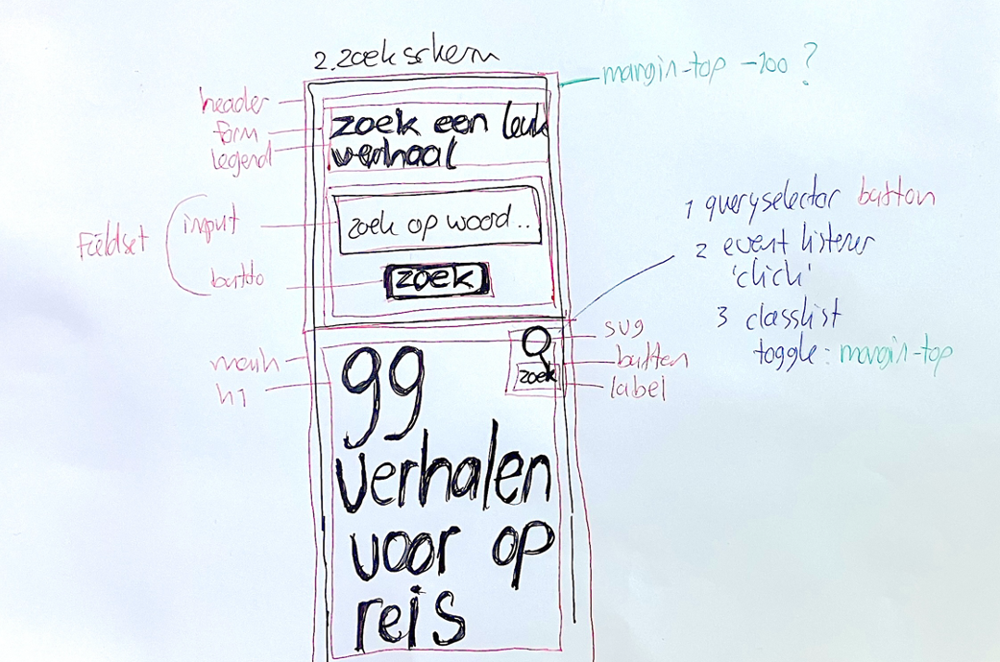

# The Client- Website

## Prototyping
Om een ontwerpprobleem op te lossen kan je verschillende (schets) technieken toepassen om grip krijgen op de opdracht, ideeën te verkennen en te onderzoeken. In de ontwerpfase van het project is het doel om snel een prototype te maken dat je kan testen en uitproberen. Zo zorg je ervoor dat je precies weet wat je moet gaan bouwen.

Een prototype kan van alles zijn, bijvoorbeeld een schets om te bespreken met iemand uit je squad, een paper-prototype om snel te kunnen testen met een gebruiker of een gedetailleerd uitgewerkt design in Figma.

De technieken die je deze sprint gaat toepassen zijn: Een _Sitemap_ tekenen van de opdracht die je hebt gekregen, een _Wireframe_ en _Wireflow_ schetsen van de pagina die je gaat ontwerpen en bouwen, een _HiFi prototype_ maken in Figma en een _Breakdown schets_ maken. 

<!-- Van schets naar Figma naar een breakdown (onderzoek) -->

<!--
### Wat kun je doen om een opdracht, een design challenge, een vraag van een opdrachtgever helder te krijgen? 
- Welke pagina's moeten er gemaakt worden? Sitemap
- Welke functionaliteiten staan er op een pagina? Wireframe
- Hoe moet het eruit zien? FIgma
- Hoe moet dat gaan werken? Wireflow/Screenflow
- Hoe ga je dat maken? Breakdown

Proces van breakdown, HTML onderzoek en CSS layout, hoe ga je de responsive layout maken? Grid? Flexbox? 

### Bronnen

- [What is prototyping](https://www.figma.com/resource-library/what-is-prototyping/)
- [Low-fidelity prototyping: What is it and how can it help?](https://www.figma.com/resource-library/low-fidelity-prototyping/)

-->

### Sitemap
Een sitemap geeft een gestructureerd overzicht van alle pagina's van een website.
Er bestaan verschillende (online) tools om sitemaps mee te maken. In sprint 2 ga je een sitemap schetsen.

#### Aanpak
Teken een sitemap van de verschillende pagina's van de opdracht die je hebt gekregen (homepage, overzichtspagina, detailpagina, aanmeldpagina, contactpagina, etc...)

1. Schrijf bovenaan de sitemap de ontwerpvraag van de opdrachtgever.
2. Onderzoek welke pagina's er zijn of gaan komen. Gebruik de briefing die je hebt gehad, de documentatie en het design dat je hebt gekregen.
3. Teken de homepage bovenaan en geef deze pagina nummer 0.
4. Teken daarna alle pagina's die onder de homepage vallen (_primary pages_), trek rechte lijnen tussen de homepage en de _primary pages_, schrijf de titel van de pagina op en geef de nummers 1.0, 2.0, 3.0, ...
5. Teken de pagina's die een niveau dieper horen (_secondary pages_), trek lijnen tussen de _primary pages_ en de bijhorende _secondary pages_, schrijf de titel van de pagina op en geef ze een nummer 2.1, 2.2, ... als ze onder pagina 2.0 vallen. 
6. Teken een niveau dieper als er nog meer pagina's zijn, pas de nummering aan, trek lijnen, etc ...
7. Bespreek je sitemap met een mentor of docent.

#### Bronnen
- [How to create a UX Sitemap: a simple guideline](https://uxdesign.cc/how-to-create-a-ux-sitemap-a-simple-guideline-8786c16f85c1)
<!-- - [Sitemaps & Information Architecture (IA)](https://xd.adobe.com/ideas/process/information-architecture/sitemap-and-information-architecture/) -->

### Wireframe en Wireflow schetsen
Een **Wireframe** is een schematische tekening van een pagina. Met een Wireframe kun je (snel) schetsen hoe een pagina er uit kan komen te zien, wat belangrijk is, welke onderdelen waar komen te staan, wat in de viewpoort staat en wat de interactieve elementen zijn. 

Je kan een Wireframe LoFi (low fidelity) of meer HiFi (high fidelity) maken met meer detail en kleuren. Voor een HiFi Wireframe kun je goed prototype software gebruiken zoals Figma. Door LoFI Wireframes te schetsen kan je snel verschillende layouts uitproberen, ideeën visualiseren, bespreken en aanpassen.

_Een LoFi Wireframe is een grove schets met genoeg details zodat het in grote lijnen te volgen is. Her en der staan kleine annotaties indien nodig_

Een **Wireflow** toont een aantal schermen van een interactie. Het is nuttig om uit te denken wat een gebruiker te zien krijgt als die iets op een pagina doet, zoals een formulier versturen of met een carrousel verschillende plaatjes of producten bekijkt. 

_Met een Wireflow laat je zien hoe een interactie op een pagina eruit komt te zien_

#### Aanpak
Teken een nette Wireframe van de pagina die je gaat bouwen in sprint 2. Als je een interactie wil gaan ontwerpen en bouwen, schets dan ook een Wireflow. 

1. Schrijf de titel en een uitleg van de pagina die je gaat ontwerpen bovenaan je schets.
2. Schets de hele pagina die je gaat maken. Geef duidelijk aan welke onderdelen waar komen te staan. Gebruik visuele hiërarchie voor belangrijke informatie, belangrijke details en achtergrondinformatie. Schrijf de titels uit en maak duidelijk wat interactieve elementen zijn, zoals buttons en links. Schets netjes met rechte lijnen en zorg dat elementen de juiste verhoudingen en formaten hebben.
3. Schets voor responive, hoe ziet de layout er uit voor *Small*, *Medium* en *Large* schermen. 
4. Bespreek je schetsen met een klasgenoot, mentor of docent. Schrijf de feedback op of maak meteen een nieuwe schets. Schets meerdere ideeën uit.
5. Schets zo nodig interacties uit in een aparte Wireflow.

#### Bronnen
- [What is wireframing?](https://www.figma.com/resource-library/what-is-wireframing/)
- [Wireflows: A UX Deliverable for Workflows and Apps](https://www.nngroup.com/articles/wireflows)

### HiFi ontwerp in Figma 
_Prototyping tools_ zoals Figma, Sketch of XD zijn handig om een ontwerp in detail uit te werken. Door je ontwerp HiFi uit te werken kun je details, interacties en interface-problemen verkennen en testen.

Nadat je een HiFi ontwerp met code gaat realiseren, gaan er vast nog dingen veranderen. 

#### Aanpak
Ontwerp de pagina die je deze sprint gaat maken in Figma. Ontwerp de hele pagina en zorg ervoor dat je al een idee krijgt van wat je in de viewpoort te zien krijgt. 

Werk het ontwerp uit voor *Small*, *Medium* en *Large* schermen. 

Als je al een ontwerp hebt gekregen kun je verder met het maken van een breakdown schets.

### Breakdown schets
Een breakdown schets is een Wireframe of Wireflow met annotaties voor de HTML, CSS en/of JS. Het is een methode die frontenders gebruiken om te onderzoeken wat voor techniek nodig is om een ontwerp te realiseren in code.

_Door het maken van een breakdown schets onderzoek je hoe je een ontwerp in code kan maken_

Door blokken in de schets te tekenen voor de HTML, de CSS properties te annoteren en ideeën op te schrijven voor de JS kom je er achter wat voor "problemen" je gaat tegenkomen. Dan kan je inspiratie en code-voorbeelden bekijken om te onderzoeken hoe je iets technisch zou kunnen oplossen. Dit gaat je ook helpen als je iets online gaat zoeken, zo kan je gericht zoeken naar oplossingen. 

#### Aanpak

Je gaat een breakdown schets maken van het ontwerp dat je hebt gemaakt (of gekregen) in Figma. 

1. Dupliceer het frame met je Figma ontwerp en noem het frame "breakdown + titel van de pagina" 
2. Teken om de content onderdelen een vierkant blok en noteer het HTML element erbij, zoals `<h1>`,`
`, `<a>` of `<li>`. Als je niet weet welk element je nodig hebt, kun je dit gaan onderzoeken (zie de bronnen hieronder), of vraag het aan een klasgenoot, mentor of docent.
2. Teken vervolgens een blok om de groeperende onderdelen en schrijf ook hier de HTML elementen erbij. Dit zijn de container elementen zoals `<article>`, `<nav>`, `<main>`, maar ook een `<ul>` voor een lijst, of `<figure>` voor een image zijn container elementen. Denk alvast na over een goede structuur.
3. Als je (ongeveer) weet welke HTML elementen je nodig hebt, kun je _bedenken_ hoe je de layout in CSS zou kunnen maken. Bekijk de verschillende HTML containers die je hebt genoteerd en bedenk hoe je ze kan vormgeven. Heb je Grid of Flexbox nodig om elementen netjes naast elkaar te tonen? Weet je hoe je elementen kan positioneren? Welke elementen staan automatisch al goed doordat er goede HTML hebt bedacht?

#### Bronnen

- [Structuring the web with HTML](https://developer.mozilla.org/en-US/docs/Learn/HTML)
- [Document and website structure](https://developer.mozilla.org/en-US/docs/Learn/HTML/Introduction_to_HTML/Document_and_website_structure)
- [HTML elements reference](https://developer.mozilla.org/en-US/docs/Web/HTML/Element)

## En wat nu, voor komende vrijdag?

1. Maak een nieuw issue aan op je project, en noem deze “Prototype naar HTML”.
2. Voeg je schetsen en eventuele opmerkingen toe aan je issue; hiermee heb je het probleem geanalyseerd en al deels ontworpen.
3. Begin aan de hand van je schetsen met het schrijven van de HTML in je editor. Zorg voor een goed fundament, waarop je volgende week CSS kunt toepassen. Probeer dus nog _geen CSS_ te schrijven, maar te beginnen met de content en de structuur, waarmee je een werkend prototype bouwt. [Valideer je HTML](https://validator.w3.org/) regelmatig om fouten te voorkomen.
4. Voor het integreren koppel je commit(s) aan je issue door het # issue nummer in je commit message(s) te noemen. Hiermee laat je in het issue je iteraties zien.
5. Zet voor vrijdag je HTML prototype live via GitHub Pages, en plaats de link bij je repo.

Tijdens de code & design review vrijdag gaan we je HTML reviewen.
