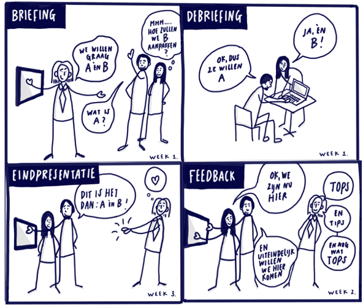

# The Client - Website

## Sprint Review

De Sprint Review is bedoeld als het officiële moment tijdens elke sprint waarin je het gemaakte werk bespreekt met de opdrachtgever. De opdrachtgever geeft feedback naar aanleiding van het (deel)product dat gedemonstreerd is. Het maakt niet uit dat de opdracht nog niet af is, je kan altijd laten zien waar je aan hebt gewerkt en bespreken of jouw oplossing overeenkomt met de wensen van de opdrachtgever.

_Laat bij de Sprint Review zien wat je hebt gemaakt, zo check je of het voldoet aan de briefing van de opdrachtgever_

De demonstratie aan de opdrachtgever moet letterlijk genomen worden. Het is dus geen PowerPoint-presentatie met daarin een weergave van de doelen en resultaten, maar het daadwerkelijk laten zien van het opgeleverde werk. Als het doel was om een website te ontwerpen en maken, demonstreer je de website zodat de opdrachtgever het kan bekijken en uitproberen. 

### Aanpak Sprint Review en voorbereiding

<!-- 
Opdracht en aanpak Sprint review

Wat is een sprint review eigenlijk? 
Waarom doe je dit? 

- Sprint review voorbereiden
- feedback halen bij de opdrachtgever
- feedback verwerken en toevoegen aan project board
-->

Voor een goede Sprint Review heb je een goede voorbereiding nodig. 
Het team zorgt voor een agenda, zodat de Review soepeltjes verloopt. 
In de Review gaat het erom dat je feedback krijgt op het gemaakte werk en dat je de feedback gebruikt voor de volgende sprint(s).

### Definieer het doel
Het is belangrijk om met een duidelijk doel naar de Sprint Review te gaan. 
Het doel kan bijvoorbeeld zijn om feedback te verzamelen over het geleverde werk, inzicht te bieden in de voortgang van het project of om aanpassingen te bespreken. 
Het definiëren van het doel helpt bij het sturen van de discussie en maakt dus uiteindelijk een effectieve Sprint Review.

##### Voorbereiding
Bespreek met studenten uit je squad die dezelfde opdracht hebben jouw doel van de Sprint Review. 
Schrijf het op en begin jouw demonstratie donderdag met het uitleggen van jouw doel aan de opdrachtgever.

### Demonstratie van het werk
Tijdens de Sprint Review geef je een demonstratie van de website. 
Leg de functionaliteiten en kenmerken duidelijk uit en laat het zien. Gebruik als beginpunt van je demonstratie je readme.  
Wil je laten zien dat het responsive werkt? Laat je website dan op verschillende apparaten zien.
Met de demonstratie test je of het werk voldoet aan de vraag van de opdrachtgever.

##### Voorbereiding
Schrijf een plan van aanpak voor jouw demonstratie, wat wil je laten zien, in welke volgorde en wat heb je daarvoor nodig?
Geef de demonstratie aan je medestudenten en een mentor en geef elkaar tips en tops voor donderdag.

### Faciliteer feedback
Een Sprint Review is bedoeld om feedback te krijgen op het geleverde werk. Zorg dat je feedback krijgt en dat de opdrachtgever wordt aangemoedigd om specifiek en constructief te zijn in hun feedback. Je kan ook vragen stellen om de behoeften en verwachtingen van de opdrachtgever (nog) beter te begrijpen.

##### Voorbereiding
Bespreek met je medestudenten welke vragen jullie aan de opdrachtgever willen stellen en schrijf de vragen op voor donderdag. Vergeet niet tijdens de Sprint Review de antwoorden op te schrijven als je je website laat zien.

### Beoordeel de feedback
Na de Sprint Review ga je de feedback beoordelen en documenteren. 
Analyseer de feedback die je hebt gekregen van de opdrachtgever en bedenk hoe je het kan in de volgende sprint kan verwerken. Neem de feedback op in je issues (en project board) met een duidelijke beschrijving.

### Bronnen

- [Sprint Review Meeting](https://scrumguide.nl/sprint-review/)
- [Dit is het geheim van een succesvolle Sprint Review in Scrum](https://scrumacademy.nl/blog/dit-is-het-geheim-van-een-succesvolle-sprint-review-in-scrum/)
